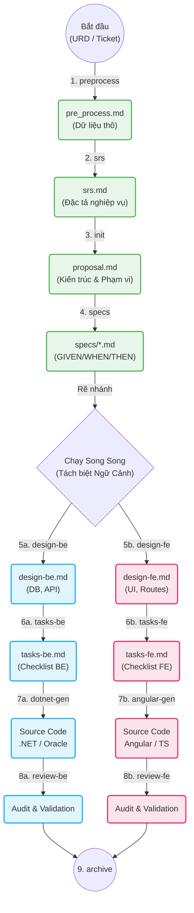
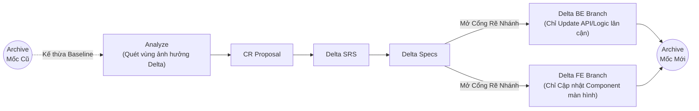
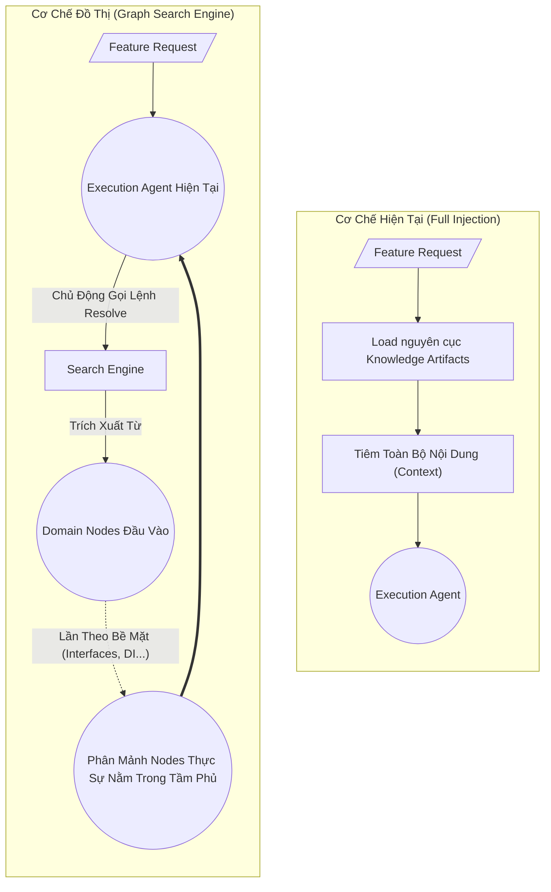

# 🤖 Kiến Trúc & Vận Hành Agent Framework
## Tài liệu phân tích và hướng dẫn tổng thể
*A comprehensive guide to Base Rule AI Architecture*

---

# 📂 0. Tổng Quan Kiến Trúc Thư Mục (Directory Architecture)

Hệ thống Agent Framework được tổ chức thành các thư mục cốt lõi sau để đảm bảo sự tách biệt giữa Logic, Kiến thức và Cấu hình:

- 🤖 **`.agent/` (Não bộ thực thi - Execution Logic)**
  - `skills/`: Chứa các lệnh thực thi (Scripts/Prompts) cho AI, được chia làm 2 loại chính:
    - **Pipeline Skills (Kỹ năng Luồng)**: Các tác vụ sản xuất trực tiếp cấu thành nên dây chuyền (VD: *init, design-be, tasks-fe*).
    - **Knowledge Extractor Skills (Kỹ năng Dò quét tri thức)**: Các công cụ (*learn-xxx*) phục vụ cho giai đoạn Deep-Learning, dùng để đọc source code và trích xuất thành tóm tắt kiến trúc.
  - `agents/`: Khai báo và định nghĩa danh tính cho các Đặc vụ (Actors) như *Dotnet Agent, Angular Agent* nhằm phân lập ranh giới năng lực và ngữ cảnh khi thực thi.
  - `workflows/`: Khai báo cách thức AI được phép vận hành, bao gồm 3 khái niệm then chốt:
    - **Pipelines (Dây chuyền)**: Chuỗi các Steps xâu nối thành luồng khép kín từ đầu đến cuối (VD: `/feature-pipeline` = preprocess → srs → init → specs → design → tasks → gen → review → archive). Pipeline giữ vai trò **nhạc trưởng**, tự động điều phối thứ tự và phân bổ Agent phù hợp cho từng Step.
    - **Steps (Bước thực thi)**: Đơn vị nhỏ nhất trong Pipeline — mỗi Step gắn với đúng 1 Skill và 1 Agent cụ thể (VD: Step `design-be` = Skill *design-be* + Agent *Dotnet*). Steps có thể được nhảy cóc (`--start-from`), dừng giữa chừng (`--stop-at`), hoặc chạy đơn lẻ (`--only`).
    - **Standalone (Độc lập)**: Các tác vụ chạy ngoài Pipeline, không thuộc dây chuyền nào — được gọi trực tiếp khi cần (VD: `confluence-reader` để đọc tài liệu Confluence, hay `/calibrate-knowledge` để hiệu chỉnh tri thức mà không cần đang trong luồng Feature).
  - `common_rules/`: Chứa các luật bất di bất dịch của hệ thống (System Rules) định hình ranh giới hành vi cốt lõi của AI.

- 📚 **`base_knowledge/` (Kho lưu trữ tri thức - Knowledge Base)**
  - `common_rules/`: Các quy định làm việc (Project Rules & Conventions) riêng biệt của đội dự án.
  - `standards/`: Bộ tiêu chuẩn Mẫu mã (Patterns) hướng dẫn cách sinh source code.
  - `structures/`: File tóm tắt kiến trúc được Scanner trích xuất từ source code, đóng vai trò bản đồ cho AI.
  
- 📜 **`openspec/` (Cấu hình & Điều hướng - Config & Routing)**
  - `config.yaml`: Khai báo tập luật chung và Stack công nghệ khái quát của dự án.
  - Vận hành như một Bộ não định tuyến (Context Router - `artifact_context_modular.yml`), quy định đóng gói Tri thức nào sẽ được nạp cho Agent nào tại Bước (Step) cụ thể để tránh "ô nhiễm" không gian token.
  - `changes/ archive`: Các thư mục con bên trong mở rộng vai trò làm kho chứa **Tri thức lưu trữ (Change Archives)** của nhóm tính năng: Đóng gói toàn bộ Baseline Specs/Design của từng tính năng sau khi đã hoàn thành, làm điểm tựa vững chắc cho các luồng yêu cầu thay đổi (Change Request - CR) về sau.

---

# 🌟 1. Cách Hoạt Động Của Workflow Pipeline

Framework vận hành dựa trên các luồng thực thi (Pipelines) được tự động hoá và cô lập ngữ cảnh, bao gồm:

1. **Feature Pipeline** (`/feature-pipeline`): 
   - Quy trình phát triển tính năng mới từ yêu cầu thô.
   - Hoạt động song song (Parallel) tách biệt Backend và Frontend để tránh nhiễu ngữ cảnh.
2. **Change Request Pipeline** (`/cr-pipeline`): 
   - Nâng cấp/chỉnh sửa tính năng đã lưu trữ (Archived Baseline).
   - Chỉ kết xuất Delta (Mã nguồn khu vực có thay đổi) để tối ưu Token.
3. **Calibrate Knowledge Pipeline** (`/calibrate-knowledge`): 
   - Quét mã nguồn, tìm lỗi (Drift) quy chuẩn và tự động học/cập nhật mẫu thiết kế (Pattern Mode).

---

# ⚙️ 1.1 Cơ chế sử dụng Pipeline (Giao tiếp bằng Flags)

*Triết lý cốt lõi: Bạn muốn AI làm gì hay bẻ lái đi đâu, hãy dùng tham số `--flag` để ra lệnh. Tránh dùng văn xuôi để điều hướng luồng vì rất dễ bị AI phân tích sai ý.*

Các cờ (flags) điều khiển luồng thực thi (Execution Routing) được ứng dụng:

- **🤖 Tự Động Nhận Diện Tiến Trình (Auto-Detect Step)**: 
  Thay vì phải gõ chi ly, bạn chỉ cần gõ `/feature-pipeline <feature-name> [--backend]`. AI sẽ tự động soi các File đã kết xuất (Artifacts) để xác định mốc hiện hành và tự động bắt rễ chạy khâu tiếp theo mà không cần bạn chỉ đạo.

- **🛡️ Điều hướng theo bộ nhớ (Tech Scope)**:
  `/feature-pipeline <name> --backend` (Ép AI khoanh vùng, "quên" đi cấu trúc Frontend để tập trung làm BE, triệt tiêu rò rỉ chéo Context/Token).
- **🚦 Thiết lập Điểm ngắt (Breakpoints)**:
  `/feature-pipeline <name> --stop-at design-be` (Ra lệnh cho AI: "Hãy chạy đến bước thiết kế BE rồi dừng lại chờ tôi duyệt!").
  `/feature-pipeline <name> --start-from tasks-be` (Lời nhắc: "Bản vẽ đã hoàn hảo, xin hãy bắt đầu chạy từ đây trở về sau").
- **🎯 Thực thi cô lập (Singleton)**:
  `/feature-pipeline <name> --only review-be` (Ép buộc: "Chỉ làm duy nhất hành động Review, cấm cập nhật râu ria").

---

# 🛠 2. Phân Cấp Tập Kỹ Năng (Skills)

Các Skills của tác tử (AI Agent) được quy hoạch thành 3 nhóm phục vụ cho các chiến lược vận hành cụ thể:

### 🧠 2.1 Deep-Learn Skills (Trích xuất kiến trúc & Base Knowledge)
Nhóm quy trình dùng để đọc trực tiếp vào source code, rút trích ra các cấu trúc, design pattern, và lưu trữ nó làm "Sách giáo khoa" phục vụ việc sinh mã nguồn:
- `learn`, `learn-architecture`, `map-structures`, `learn-entity-dbcontext`, `learn-ng-architecture`...
- *Chuyên sâu*: `learn-approval-flow`, `learn-unified-approval`, `learn-thirdparty-call`, `learn-ng-component`...

---

# 🛠 2. Phân Cấp Tập Kỹ Năng (Tiếp theo)

### 🌊 2.2 Workflow Skills (Các Bước Trong Pipeline)
Các kỹ năng chạy tuần tự để kết nối tài liệu thành quy trình phát triển khép kín:
- **Requirements/BA**: `preprocess`, `srs`, `specs`
- **Architecture**: `init`, `design-be`, `design-fe`
- **Execution & CI/CD**: `tasks-be`, `tasks-fe`, `apply`, `sync-task`
- **Quality Assurance & Maintenance**: `review-be`, `review-fe`, `cr-analyze`, `archive`

### 🛡️ 2.3 Standard Skills (Công cụ lõi của Agent)
Kỹ năng công cụ hỗ trợ để tra cứu hoặc thiết kế chuyên biệt (Standalone tools):
- `confluence-reader`, `design-be` (generator), `design-fe` (generator)

---

# 📜 3. Rules: Project Rules vs System Rules

Agent được gò ép bởi hàng rào ranh giới (Guardrails) được chia làm 2 hệ thống độc lập:

### ⚙️ System Rules (`.agent/common_rules/`) 
Các luật "Bất Di Bất Dịch" quy định **Hành vi cốt lõi** của AI:
- `SYS-01-system-scope`: Giới hạn không gian hoạt động.
- `SYS-02-workflow-constraint`: Ép buộc tuân thủ luồng phân tích.
- `SYS-04-tool-usage` & `SYS-05-coding-discipline`: Nguyên tắc dùng lệnh, sửa file.

### 🏙️ Project Rules (`base_knowledge/common_rules/`)
Các luật "Nhập Gia Tuỳ Tục" tuỳ biến riêng cho hệ thống phần mềm của Team Dev:
- `PRJ-01` -> `PRJ-03`: Quy định Database (Naming, LDM, Gen table Oracle).
- `PRJ-04`, `PRJ-05`, `PRJ-07`, `PRJ-09`: Convention cho .NET Layer, Angular, API Response.
- `PRJ-06-owasp-security-scan`, `PRJ-08-logging-rules`: Quy chuẩn bảo mật & theo dõi lỗi.

---

# 🏗️ 4. Cấu Trúc (Structures) Hoạt Động Ra Sao?

Thư mục `base_knowledge/structures/` được coi là **Não Phụ** của AI.

- **Vấn đề**: Việc ném toàn bộ mã nguồn của một hệ thống LỚN đang có sẵn vào bộ nhớ AI để phát triển tính năng mới là bất khả thi (Tràn Token).
- **Giải pháp**: AI sử dụng Pipeline `calibrate-knowledge --learn` để tóm tắt mã nguồn và dịch các quy luật mã hoá (DI, Repo Pipeline, Module Config) thành dạng Văn Bản Tóm Gọn (Markdown). 
- Các file văn bản tóm gọn này (VD: `knowledge_architecture.md`, `knowledge_ng_component.md`) chính là **Structures**. Tại mỗi bước trong Workflow thay vì tải mã nguồn rác, AI nạp đúng file Structure chứa thông lệ của dự án. Điều này giúp ngăn chặn hoàn toàn "Ảo giác hệ thống" (Hallucination).

---

# 🧩 5. Vai Trò Của Các File OpenSpec Configuration

### 📄 `openspec/mapping/artifact_context_modular.yml`
**Hệ thống phân luồng trí tuệ (Context Router)**:
- Nơi định nghĩa chính xác Pipeline Step nào, Agent nào sẽ được nạp tri thức gì (Rules, Skills, Structures).
- **Tác dụng**: Cấu hình *Tuyển chọn tri thức*. Một tác vụ BE sẽ KHÔNG học tri thức FE (và ngược lại) để tránh phung phí bộ nhớ. Nó giống như bộ não của Đạo diễn phân vai diễn viên và đưa kịch bản riêng cho từng diễn viên.

### 📄 `openspec/config.yaml`
**Hệ thống thiết lập cơ sở (Global Config)**:
- Định nghĩa stack công nghệ tổng quát: `C#, .NET 8, Oracle, Angular 17`.
- Cấu trúc ghép nối cơ bản của *Rules Pipeline* và các luật cứng mang tính toàn cục (ví dụ: *MUST ensure full traceability*).

---

# 🚀 6. Vòng Khởi Tạo Dự Án Lần Đầu (Init Project)

*Quy trình bắt buộc khi thiết lập AI cho dự án mới để học cấu trúc hệ thống:*

1. **Gắn kết Framework**: Sao chép nguyên gốc các thư mục `.agent`, `base_knowledge` và `openspec` từ repository Base Rule sang dự án cần import.
   > ⚠️ **Tùy chọn phụ (Chỉ áp dụng nếu khác Stack Công Nghệ)**: Nếu dự án đích sử dụng kiến trúc khác hoàn toàn bản gốc (VD: Node.js/Vue thay vì .NET/Angular), hãy dùng prompt yêu cầu AI tự động đọc cấu trúc mã nguồn mới và refactor lại các script bên trong thư mục `.agent/skills/learn-*` cho phù hợp trước khi làm bước tiếp theo.
   > 🤖 **Prompt Mẫu Cân Chỉnh:** *"Tôi vừa import bộ khung `.agent` từ dự án ASP.NET/Angular sang hệ thống hiện tại của tôi (VD: Java Spring Boot/React). Hãy phân tích cấu trúc mã nguồn mới này và refactor (viết lại) toàn bộ Script của các kỹ năng bên trong folder `.agent/skills/learn-*`. Đảm bảo Scanner mới sẽ biết cách dò tìm và trích xuất đúng Controller, Service, DTO, Components của stack hiện tại thay vì .NET."*
2. **Thiết lập Bản đồ gốc**: Chạy lệnh `/calibrate-knowledge --map` để AI lập chỉ mục cấu trúc cây thư mục và cấu trúc tổng quát (`system_overview.md`).
3. **Đồng Bộ Quy Chuẩn Code (Phase Scan / Auto-Healing)**: Chạy lệnh `/calibrate-knowledge --<tech> --scan` để AI đối chiếu mã nguồn thực tế với các tập luật mẫu. Nếu thói quen Code của dự án khác với quy chuẩn cũ, hệ thống sẽ tự động điều chỉnh và cập nhật lại file kỹ năng bên trong thư mục `base_knowledge/standards/` để thích nghi.
4. **Nạp Tri Thức Backend (.NET / BE Tech)**: 
   Chạy lệnh `/calibrate-knowledge --<tech> --learn` với tùy chọn theo các Phase chuyên sâu:
   - **Phase Core**: Quét các tầng cấu trúc lõi (Architecture, Entity/DbContext, DTO, Controller, Service, Mapper).
   - **Phase Advanced**: Quét các module nghiệp vụ phức tạp (Authen, Approval Flow, Procedure, Report, Contract).
   - **Phase Cross**: Bóc tách cơ chế xử lý lỗi (Error/Debug) và quét liệt kê Đăng ký Tính Năng (Features Registry).
5. **Nạp Tri Thức Frontend (Angular / FE Tech)**: 
   Chạy lệnh `/calibrate-knowledge --<tech> --learn` để bóc tách kiến trúc FE vòng ngoài (Components, Directives, Pipes, Service Utilities).

*(Đến đây, AI đã tự hiệu chỉnh xong bộ Tiêu Chuẩn lẫn "Sách Giáo Khoa" và sẵn sàng chạy luồng tính năng!)*

---

# 📈 7. Vòng Đời Phát Triển Tính Năng (Feature Pipeline)

---

# 🔄 8. Vòng Đời Nâng Cấp/Chỉnh Sửa (CR Pipeline)

*Sử dụng khi có yêu cầu thay đổi (Change Request) cho một tính năng ĐÃ HOÀN THÀNH trước đó.* Quy trình này tập trung hoàn toàn vào sinh mã ở vùng chênh lệch (Delta), không tư duy tạo mã nguồn rác từ đầu.

**Điều kiện kiên quyết (Prerequisites):** 
1. Thư mục Feature đó phải ở trạng thái đã được lưu trữ (Archived) - Tức là đã tồn tại bộ Code cắm sẵn vào source.
2. Hệ thống Archive Gốc phải còn đủ file Design, Specs làm điểm tựa (Baseline).

**Sức mạnh lõi của CR Pipeline:**
- Không "đoán mò" ngữ cảnh vì kế thừa 100% quyết định kiến trúc (`design-be`/`design-fe`) từ mốc Archive cũ.
- Tối ưu Input Token do AI chỉ phải rà soát và sinh code cho các Module (Delta) bị ảnh hưởng, tiết kiệm chi phí Token API cực lớn cho các task vá lỗi.

---

# 💸 8.1 Nút Thắt Chi Phí & Giới Hạn Của Kiến Trúc Tĩnh

*Số liệu thực tế trích xuất từ báo cáo vận hành (`/token-usage-report.md`) của tính năng App Version Management V2*

**Triệu chứng "Béo phì" Token Context:**
- **Tiêu hao tài nguyên khổng lồ:** Việc phát triển trọn vẹn 1 tính năng nhỏ (trải qua 14 steps) đã ngốn tới **~575,000 Input Tokens** (gấp 5.5 lần số lượng Output Tokens sinh ra).
- **Chi phí đắt đỏ phi lý:** Phí API (sử dụng *Claude Opus 4.6*) cho riêng tính năng này lên đến **$16.50**.
- **Điểm nóng (Bottleneck):**
  - Các khâu đúc Code (`razor-fe`, `dotnet`) ăn mòn tới 55,000 - 80,000 Input Tokens mỗi lần gọi.
  - Khâu Audit/Review (`review-fe`, `review-be`) ngốn 65,000 - 85,000 Input Tokens do phải tải vô tội vạ toàn bộ luật rà soát và cấu trúc source cũ.
  
**=> Động lực sống còn:** Cơ chế **"Full Injection"** hiện tại (nhồi nhét toàn bộ Knowledge, Design, Convention dạng Text vào mỗi bước) gây ra lãng phí nghiêm trọng. Đây chính là lý do bức thiết buộc framework phải nâng cấp lên **Kiến Trúc Đồ Thị (Graph Pipeline)** nhằm "cắt phăng" mớ bối cảnh rác bị lặp lại!

---

# 🔮 9. Định Hướng Chuyển Dịch Tương Lai: Knowledge Graph Pipeline

*Thay đổi cơ chế suy luận tĩnh (Static Reasoning) hiện tại chuyển sang mô hình Tìm kiếm Động (Dynamic Graph Search Engine) nhằm giải quyết bài toán giới hạn Context.*

**Sự khác biệt trong tư duy vận hành (Reasoning Shift):**

1. **Hiện Tại (Flat / Injection Mode)**:
   - Khi Agent chạy một chức năng, nó đào vào kho Artifacts và Load **TẤT CẢ** các đoạn mã, rules, requirements và tiêm (Inject) một lúc vào Prompt để xử lý. (Dễ gây tràn Memory, ô nhiễm Context).

2. **Chuyển Dịch Tương Lai (Graph Context / Resolution Mode)**:
   - Các Đặc vụ chuyên biệt tại từng điểm mút (như **.NET Agent** hay **Angular Agent**) sẽ TỰ MÌNH gọi truy vấn ngầm (Script) vào **Search Engine**.
   - Thay vì bị động nhận toàn bộ File rác rưới, Agent chủ động khai báo các tâm điểm **Domain Nodes** (tên Class, Service...).
   - Từ tâm điểm đó, Search Engine lần ngược theo các Cạnh (Edges / Base classes / Dependencies) để trả về chính xác tệp tri thức thu gọn (Knowledge Chunk) cho Agent xử lý.

**Mũi nhọn chiến lược mang lại:**
1. **Zero Hallucination / Token Saving**: Hệ thống chỉ nhặt ra chính xác các mối nối cực hẹp (Dependencies Node), loại bỏ hoàn toàn mã mồi rác dư thừa.
2. **Khả năng tự nghiên cứu (Dynamic Learning)**: Graph Agent có thể tự do mở đường nhánh truy vấn sâu hơn nếu một Node cung cấp chưa đủ tri thức để sinh Code, tự học cách xử lý vòng thay vì đi vào bế tắc như File tĩnh.

---

# 🔮 9.1. Sự Dịch Chuyển Của Hệ Sinh Thái Tri Thức Tĩnh

Khi nâng cấp lên kiến trúc Graph, chức năng của các khái niệm truyền thống thiết lập trước đó sẽ thay đổi ra sao?

### ❌ 1. Nhóm Kỹ Năng Dò Quét (`learn-***`)
- **Trạng thái**: Sẽ rụng bỏ chức năng xuất/lưu trữ file Markdown tĩnh (`knowledge_*.md`), giải quyết dứt điểm độ trễ thông tin (Knowledge Drift).
- **Hình thái mới**: Chuyển hoá thành các **Graph Indexers** chạy ngầm. Phân tách mã nguồn bằng AST (Abstract Syntax Tree) và nạp thẳng thành các mạng lưới móc xích (Nodes/Edges) trên Graph Database theo thời gian thực.

### 🛡️ 2. Bộ Tiêu Chuẩn (`base_knowledge/standards/`)
- **Trạng thái**: **VẪN DUY TRÌ BẮT BUỘC**! Đồ thị làm tốt việc tìm kiếm "Sự thật" (Hệ thống *đang* gọi tới đâu), nhưng AI vẫn cần Sách Giáo Khoa để biết "Tính năng mới *NÊN ĐƯỢC CODE* theo hình mẫu nào". 
- **Hình thái mới**: Thiết kế chuẩn được nhúng thẳng vào Đồ thị dưới chức danh **Exemplar Nodes (Các Node Tham Chiếu Mẫu Mực)**. Agent sẽ tự dùng Graph truy vấn Node biểu mẫu này để đúc code mới.

